<!-- Hero: Animated Name -->

  

<!-- Typing line (optional: remove if you don’t want external services) -->

  

<!-- Socials -->

  
  
  
  
  

<!-- Wave divider -->

  

# 💼 Pradeepan's Portfolio

Welcome to my GitHub Portfolio! I’m **Pradeepan**, a passionate Computer Science Engineering student specializing in **Artificial Intelligence and Machine Learning**. My mission is to build impactful AI solutions that solve real-world problems.

---

## 🚀 About Me

- 🎓 Student at **KIT - Kalaignar Karunanidhi Institute of Technology**, CSE (AI & ML)
- 🤖 Interested in **AI, ML, Data Science, Prompt Engineering, Data Analytics, Full Stack Development**
- 🧠 Lifelong learner passionate about problem-solving and smart applications
- 🌐 Completed **Google UX Design** & **AWS Cloud Technical Essentials**
- 🛠️ Building smart, scalable, and efficient applications

---

## 📂 Projects

### 🔍 AI/ML Projects
- **Chatbot using NLP** – A conversational assistant using NLP (NLTK/spaCy) with intent recognition, entity extraction, and context-aware replies.
- **Medical Diagnosis using AI** – ML-based disease prediction from symptoms/medical data to assist clinicians with faster, more accurate decisions.

### 🌐 Web Development
- **Portfolio Website** – Personal portfolio using React + Tailwind CSS
- **Mini Web App** – To-do app with Node.js backend and REST APIs

### 📊 Data Science
- **COVID-19 Analysis** – Exploratory analysis & visualization in Pandas + Matplotlib with trend insights

> 📌 Visit the **Projects** folder for source code, explanations, and demo links.

---

## 🛠️ Tech Stack

- **Languages**: Python, Java, C, JavaScript, C++
- **Frameworks/Libraries**: TensorFlow, scikit-learn, React.js, Node.js
- **Tools**: Git, VS Code, Figma, Postman
- **Platforms**: AWS, GitHub, Google Cloud

---

## 📫 Contact Me

- 📧 Email: **kit27.am37@gmail.com**
- 🌐 Portfolio: **https://pradeepan1.github.io/portfolio/**
- 🔗 LinkedIn: **https://www.linkedin.com/in/pradeepan1/**
- 👨🏽‍💻 CodeChef: **https://www.codechef.com/users/pradeepan1**
- 🧩 LeetCode: **https://leetcode.com/pradeepan1**

---

## 📈 GitHub Stats

---

  

Thanks for visiting! If you like something here, ⭐ a repo or connect with me 😊
